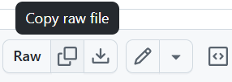
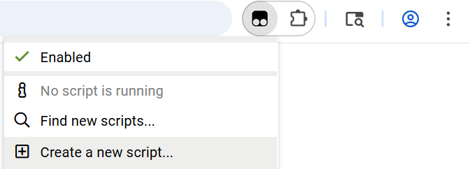

# About

Welcome! This is a free, publicly available script containing a collection of QoL features that I have written for flowr.fun players. This is a very new project right now, so you can look forward to many additional features being added in the future. If you have any feedback or any features/ideas that you want to be added, please feel free to message me on Discord (username: pigeonbar) or submit a feature request on this GitHub repository!

I intend to comply with all guidelines and conditions set by the flowr developers. Please report any compliance-related issues to me as needed, and I will fix them asap.

This project exists to support up-and-coming players who have trouble gaining access to QoL scripts because they have not gotten into Elocord (a private community of elite flowr players.) If you are in Elocord, then you'll likely want to use Elocord's private scripts instead, since they are an *extremely* good upgrade compared to my scripts. Additionally, I may have completely screwed over my relations with some Elocord members, so if you are applying to get into Elocord, you are advised to uninstall my scripts in order to avoid social ridicule from Elocord members.

Finally, this project is not associated with Flamescript in any way. I just thought that "Cinderscript" would be a cool name for my script, given the existence of an old script named "Flamescript".

# Installation steps

The userscript is stored at [dist/cinderscript.user.js](https://github.com/PigeonBar/flowr-cinderscript/tree/main/dist/cinderscript.user.js).

This script is meant to be installed using a userscript manager, such as Tampermonkey. If needed, you can install Tampermonkey itself through their [official website](https://www.tampermonkey.net/). Afterward, you can install individual scripts by following these steps:

1. Navigate to the file (e.g., [dist/cinderscript.user.js](https://github.com/PigeonBar/flowr-cinderscript/tree/main/dist/cinderscript.user.js)) on Github, then click on the "Copy raw file" button, which copies the file's contents to your clipboard. (It will be the button *adjacent* to the button that says "Raw".)

2. Navigate to flowr.fun, then click on Tampermonkey's "Create a new script" button, which will open Tampermonkey's script editor.

3. Paste the script contents (Ctrl+V) into the editor, then save the script (Ctrl+S).

After this initial installation, Tampermonkey should automatically take care of finding detecting and applying updates to your installed script.

(In the future, I may also look into other script hosting sites, such as Greasy Fork, to help simplify these installation steps for you.)

# Security notice

Currently, this Github repository (https://github.com/PigeonBar/flowr-cinderscript) is the **only official source** for my script. If you ever receive my script as a file from any other source, then **do not trust that source**, since bad actors may have tampered with the file to add malicious code.

Likewise, if you would like to share my script with others, then please link them to this Github repository instead of directly sending them my script as a file. Thank you for helping to keep other flowr players safe online.